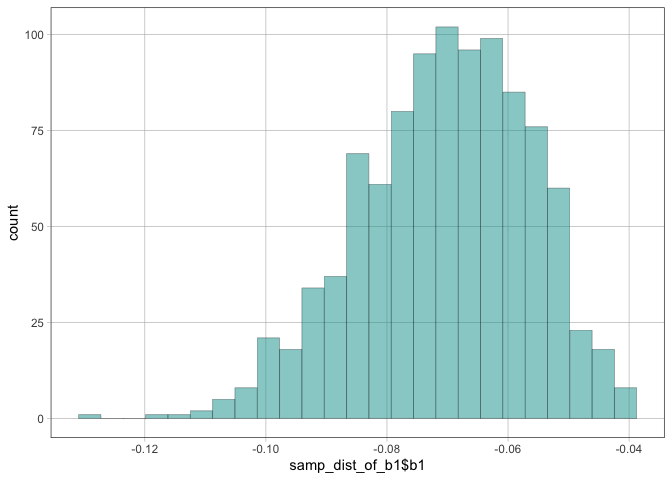
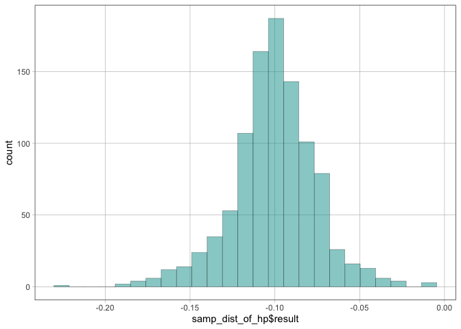
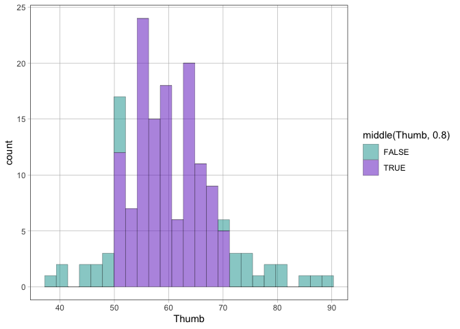

<!-- README.md is generated from README.Rmd. Please edit that file -->

# coursekata 

<!-- badges: start -->

[](https://CRAN.R-project.org/package=coursekata)
[](https://github.com/coursekata/coursekata-r/actions)
[](https://app.codecov.io/gh/coursekata/coursekata-r)
<!-- badges: end -->

## Overview

*CourseKata Statistics and Data Science*, is an innovative interactive
online textbook for teaching introductory statistics and data science in
colleges, universities, and high schools. Part of CourseKata’s *Better
Book* Project, we are leveraging research and student data to guide
continuous improvement of online learning resources. The **coursekata**
package is designed to make it easy to install and load the packages,
functions, and data used in the book and supplementary materials.

Learn more about CourseKata and its services and materials at
[CourseKata.org](https://www.coursekata.org/).

This package makes it easy to install and load all packages and
functions used in CourseKata courses. It additionally provides a handful
of helper functions and augments some generic functions to provide
cohesion between the network of packages. This package was inspired by
the [tidyverse](https://tidyverse.tidyverse.org) meta-package.

## Installation

``` r
install.packages("coursekata")
```

After installing the core packages, you might want to install the
supplementary data packages used in the course. These are not required
for the package to work, but they are used in the course materials. You
can install them with the following command:

``` r
coursekata::coursekata_install()
```

If you don’t install these packages, you will be prompted to install
them each time you load the package. If you want to disable that prompt,
you can set `options(coursekata.quickstart = TRUE)`.

### Development version

To get a bug fix or to use a feature from the development version, you
can install the development version of `coursekata` from GitHub.

``` r
# install.packages("pak")
pak::pak("coursekata/coursekata-r")
```

## Loading Packages Used in CourseKata Courses

`library(coursekata)` will load the following core packages in addition
to the [functions and theme](#functions-and-theme) included in the
`coursekata` package:

``` r
library(coursekata)
#> ── CourseKata packages ──────────────────────────── coursekata 0.18.1 ──
#> ✔ dslabs              0.8.0       ✔ Metrics             0.1.4
#> ✔ Lock5withR          1.2.2       ✔ lsr                 0.5.2
#> ✔ fivethirtyeightdata 0.1.0       ✔ mosaic              1.9.1
#> ✔ fivethirtyeight     0.6.2       ✔ supernova           3.0.0
#> 
#> Attaching package: 'coursekata'
#> 
#> 
#> The following object is masked from 'package:datasets':
#> 
#>     penguins
```

- [supernova](https://cran.r-project.org/package=supernova), for
  - creating ANOVA tables.
  - tools for extracting information from fitted models (`b0()`, `b1()`,
    `PRE()`, `fVal()`)
  - an augmented `print.lm()` which prints the fitted equation as well
  - … and more!
- [mosaic](https://cran.r-project.org/package=mosaic), for a unified
  interface to most statistical tools.
- [ggformula](https://cran.r-project.org/package=ggformula), for a
  formula interface to ggplot2.
- [dplyr](https://cran.r-project.org/package=dplyr), for data
  manipulation.
- [Metrics](https://cran.r-project.org/package=Metrics), for model
  evaluation.

In addition to useful functions, a great deal of data sets are used by
instructors who teach the course. This package installs these:

- [fivethirtyeight](https://cran.r-project.org/package=fivethirtyeight)
- [fivethirtyeightdata](https://fivethirtyeightdata.github.io/fivethirtyeightdata/index.html)
- [Lock5withR](https://cran.r-project.org/package=Lock5withR)
- [dslabs](https://cran.r-project.org/package=dslabs)

### Startup options

- `coursekata.quickstart`: Each time the package is loaded (e.g. via
  `library(coursekata)`) a check is run to ensure that all the
  dependencies are installed and reasonably up-to-date. If they are not,
  you will be prompted to install missing packages. This can be disabled
  by setting `options(coursekata.quickstart = TRUE)`.

- `coursekata.quiet`: By default, the package will show all startup
  messages from the dependent packages. To quiet these (like in the
  output above), you can set `options(coursekata.quiet = TRUE)`

## Functions and Theme

This package also comes with a variety of functions useful for teaching
statistics and data science, and it has an automatically set `ggplot2`
theme complete with colorblind-friendly palettes and other improvements
to aid perception and clarity of plots.

### Estimate Extraction (and Bootstrapping)

Extracting an estimate is as easy as passing a fitted linear model to
one of the extraction functions:

``` r
fit <- lm(mpg ~ hp, data = mtcars)

# the estimate for β₀, the intercept
b0(fit)
#> [1] 30.09886

# the estimate for β₁, the slope
b1(fit)
#> [1] -0.06822828

# all the estimates
b(fit)
#> $b_0
#> [1] 30.09886
#> 
#> $b_hp
#> [1] -0.06822828

# the proportional reduction in error
pre(fit)
#> [1] 0.6024373

# Fisher's F value
f(fit)
#> [1] 45.4598

# the p-value for the F test
p(fit)
#> [1] 1.787835e-07
```

The estimate extraction functions help to simplify the ability to create
bootstrapped sampling distributions of those estimates. Here is an
example of bootstrapping the slope:

``` r
# use mosaic package to repetitively resample to bootstrap a distribution
samp_dist_of_b1 <- do(1000) * b1(lm(mpg ~ hp, data = resample(mtcars)))

# plot the bootstrapped estimates
gf_histogram(~ samp_dist_of_b1$b1)
```

<!-- -->

Other estimates and terms can be bootstrapped using the same technique,
but you will need to calculate the values yourself. Here’s an example of
doing that for a term that doesn’t have a dedicated extraction function:

``` r
samp_dist_of_hp <- do(1000) * {
  # create a new model from the resampled data
  model <- lm(mpg ~ disp * hp, data = resample(mtcars))

  # extract the desired estimate, here the coefficient for hp
  coef(model)[["hp"]]
}

# plot the bootstrapped estimates
gf_histogram(~ samp_dist_of_hp$result)
```

<!-- -->

### Sectioning a Distribution

When teaching about hypothesis testing, *F*, and *p*-value, it is useful
to mark different portions of a distribution as inside or outside the
critical zone. `middle()`, `upper()`, and `lower()` each take a
distribution of values and return whether the value was in, e.g. the
middle 95% of the distribution. Use this with a plotting function to
shade in those areas:

``` r
# shade in the middle 80% of the Thumb distribution
gf_histogram(~Thumb, data = Fingers, fill = ~ middle(Thumb, .80))
```

<!-- -->

### Toggling the Theme

The `ggplot2` theme is loaded by default but can be toggled on and off
via `coursekata_load_theme()` and `coursekata_unload_theme()`. The
actual plot theme and scale components are also provided for advanced
users as `theme_coursekata()` and `scale_discrete_coursekata()`
(`viridis` is used for continuous color scales).

# Contributing

If you see an issue, problem, or improvement that you think we should
know about, or you think would fit with this package, please let us know
on our [issues page](https://github.com/coursekata/coursekata-r/issues).
Alternatively, if you are up for a little coding of your own, submit a
pull request:

1.  Fork it!
2.  Create your feature branch: `git checkout -b my-new-feature`
3.  Commit your changes: `git commit -am 'Add some feature'`
4.  Push to the branch: `git push origin my-new-feature`
5.  Submit a [pull
    request](https://github.com/coursekata/coursekata-r/pulls) :D
